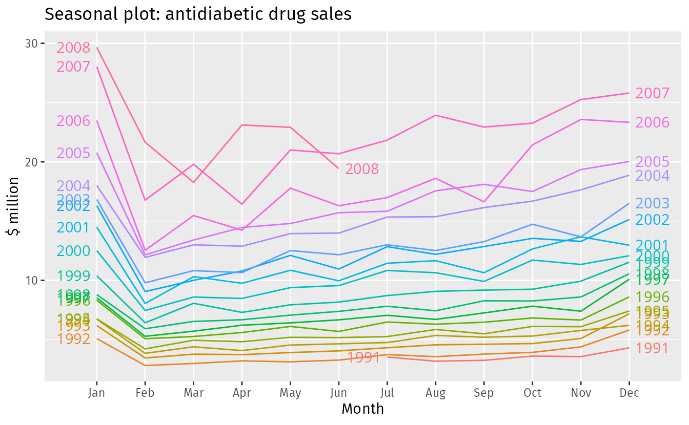

# Forecasting: Principles and Practice

Este repositório contém resumo do material oriundo e da implementação do que consta na segunda edição do livro on-line de ``Rob J Hyndman`` e ``George Athanasopoulos``, disponível em [https://otexts.com/fpp2/](https://otexts.com/fpp2/)

Há uma terceira edição do livro, disponível em [https://otexts.com/fpp3](https://otexts.com/fpp3)

Voltar para [../README.md](../README.md)

# 2. Chapter 2 Time series graphics

A primeira coisa a fazer em qualquer tarefa de análise de dados é plotar os dados. Os gráficos permitem que muitas características dos dados sejam visualizadas, incluindo padrões, observações incomuns, mudanças ao longo do tempo e relacionamentos entre variáveis.

## 2.1. ``ts`` objects

Uma série temporal pode ser pensada como uma lista de números, junto com algumas informações sobre em que momento esses números foram registrados. Essas informações podem ser armazenadas como um objeto ``ts`` em R.

```bash
y <- ts(c(123,39,78,52,110), start=2012)
```

## 2.2. Time plots

Para dados de séries temporais, o gráfico óbvio para começar é um gráfico de tempo. Ou seja, as observações são plotadas em relação ao tempo de observação, com observações consecutivas unidas por linhas retas.

```bash
# ./ch02-2.2-1.R

autoplot(melsyd[,"Economy.Class"]) +
  ggtitle("Economy class passengers: Melbourne-Sydney") +
  xlab("Year") +
  ylab("Thousands")

```

Que deveria gerar o gráfico a seguir:


Outra série temporal mais simples pode ser gerada pelo código e exibido em no gráfico a seguir:

```bash
# ./ch02-2.2-2.R

autoplot(a10) +
  ggtitle("Antidiabetic drug sales") +
  ylab("$ million") +
  xlab("Year")

```

Que deveria gerar o gráfico a seguir:


Aqui, há uma tendência clara e crescente. Há também um forte padrão sazonal que aumenta de tamanho conforme o nível da série aumenta. A queda repentina no início de cada ano é causada por um esquema de subsídios do governo que torna mais econômico para os pacientes estocarem medicamentos no final do ano civil. Quaisquer previsões desta série precisariam capturar o padrão sazonal e o fato de que a tendência está mudando lentamente.

##  2.3. Time series patterns

Ao descrever essas séries temporais, usamos palavras como "tendência" e "sazonal", que precisam ser definidas com mais cuidado.

* Trend (tendência) - Uma tendência existe quando há um aumento ou diminuição de longo prazo nos dados.
* Seasonal (sazonal) - Um padrão sazonal ocorre quando uma série temporal é afetada por fatores sazonais, como a época do ano ou o dia da semana. A sazonalidade é sempre de uma frequência fixa e conhecida.
* Cyclic (cíclica) - Um ciclo ocorre quando os dados exibem subidas e descidas que não são de uma frequência fixa.

Muitas pessoas confundem comportamento cíclico com comportamento sazonal, mas eles são realmente bem diferentes. Se as flutuações não são de uma frequência fixa, então elas são cíclicas; se a frequência é imutável e associada a algum aspecto do calendário, então o padrão é sazonal. Em geral, a duração média dos ciclos é maior do que a duração de um padrão sazonal, e as magnitudes dos ciclos tendem a ser mais variáveis ​​do que as magnitudes dos padrões sazonais.

Os exemplos nos gráficos a seguir mostram diferentes combinações dos componentes acima.


## 2.4. Seazonal plots

Um gráfico sazonal é similar a um gráfico de tempo, exceto que os dados são plotados em relação às "estações" individuais nas quais os dados foram observados. Um exemplo é dado abaixo mostrando as vendas de medicamentos antidiabéticos.

```bash
# ./ch02-2.4-1.R

ggseasonplot(a10, year.labels=TRUE, year.labels.left=TRUE) +
  ylab("$ million") +
  ggtitle("Seasonal plot: antidiabetic drug sales")

```

Que deveria gerar o gráfico a seguir:



Uma variação útil no gráfico sazonal usa coordenadas polares. A configuração ``polar=TRUE`` torna o eixo da série temporal circular em vez de horizontal, como mostrado abaixo.

```bash
# ./ch02-2.4-2.R

ggseasonplot(a10, polar=TRUE) +
  ylab("$ million") +
  ggtitle("Polar seasonal plot: antidiabetic drug sales")

```

Que deveria gerar o gráfico a seguir:


#### Nota de estudo:

Em comparação à exibição dos dados no formato de gráfico polar, ao invés de sazonal, podemos destacar que no gráfico polar temos:

**Representação POLAR**

* Visualização compacta de sazonalidade - Forma intuitiva para identificar padrões.
* Destaque do comportamento cíclico - Padrões sazonais ou repetições ficam mais evidentes. É especialmente útil para dados com periodicidade clara, como padrões diários, semanais ou anuais.
* Estética e interpretação alternativa - Forma circular, em certos casos, é mais intuitiva para comunicar padrões a públicos não técnicos.
* Compreensão de anomalias - Facilita a detecção de preíodos fora do padrão ou que apresentam valores discrepantes em relação à normalidade do ciclo.

**Representação Sazonal Convencional**

* Comparação direta entre períodos - Em um gráfico sazonal convencional, como linhas ou barras, a comparação entre diferentes períodos é direta e quantitativamente mais precisa, pois os eixos cartesianos ``(x, y)`` são lineares e fáceis de interpretar.
* Facilidade na análise de tendências e sazonalidade conjuntas - Tendências de longo prazo e variações sazonais são mais facilmente integradas e analisadas juntas. Isso é importante em dados que possuem componentes adicionais além da sazonalidade.
* Quantificação precisa - Ideal para explorar valores exatos e realizar análises quantitativas, pois os eixos fornecem escalas que podem ser diretamente utilizadas para medições.

**Diferenças Fundamentais**

| Aspecto | Gráfico POLAR | Gráfico Sazonal Convencional |
| --- | --- | --- |
| Uso principal | Identificar padrões cíclicos sazonais | Comparar valores em diferentes períodos |
| Facilidade de leitura	| Mais intuitivo para dados com periodicidade clara	| Mais útil para análise detalhada de valores |
| Comunicação visual | Estética e compreensível a não-técnicos | Mais técnico e direto |
| Detalhamento | Boa para padrões gerais, não valores exatos | Boa para detalhes quantitativos |

## 2.5. Seasonal subseries plots

Um gráfico alternativo que enfatiza os padrões sazonais é aquele em que os dados de cada estação são coletados em minigráficos temporais separados.

```bash
# ./ch02-2.5-1.R

ggsubseriesplot(a10) +
  ylab("$ million") +
  ggtitle("Seasonal subseries plot: antidiabetic drug sales")

```

Que deveria gerar o gráfico a seguir:


As linhas horizontais indicam as médias para cada mês. Esta forma de gráfico permite que o padrão sazonal subjacente seja visto claramente, e também mostra as mudanças na sazonalidade ao longo do tempo. É especialmente útil para identificar mudanças dentro de estações específicas.

## 2.6. Scatterplots

O gráfico a seguir mostra duas séries temporais: demanda de eletricidade de meia hora (em Gigawatts) e temperatura (em graus Celsius), para 2014 em Victoria, Austrália. As temperaturas são para Melbourne, a maior cidade de Victoria, enquanto os valores de demanda são para todo o estado.

```bash
# ./ch02-2.6-1.R

autoplot(elecdemand[,c("Demand","Temperature")], facets=TRUE) +
  xlab("Year: 2014") + ylab("") +
  ggtitle("Half-hourly electricity demand: Victoria, Australia")

```

Que deveria gerar o gráfico a seguir:


Podemos estudar a relação entre demanda e temperatura plotando uma série em relação à outra.

Onde temos temperatura no eixo ``x`` e demanda no eixo ``y``.

```bash
# ./ch02-2.6-2.R

as.data.frame(elecdemand) |>
  ggplot(aes(x=Temperature, y=Demand)) +
  geom_point() +
  ylab("Demand (GW)") + xlab("Temperature (Celsius)")

```

Que deveria gerar o gráfico a seguir:


Este diagrama de dispersão nos ajuda a visualizar a relação entre as variáveis. É claro que a alta demanda ocorre quando as temperaturas são altas devido ao efeito do ar condicionado. Mas também há um efeito de aquecimento, onde a demanda aumenta para temperaturas muito baixas.

### Correlation

É comum calcular *coeficientes de correlação* para medir a força da relação entre duas variáveis. A correlação entre variáveis ``x`` e ``y`` é dada por:
$$r = \frac{\sum{((x_{t} - \bar{x}) * (y_{t} - \bar{y}))}}{\sqrt{\sum{(x_{t} - \bar{x})^2}} * \sqrt{\sum{(y_{t} - \bar{y})^2}}}$$

O valor de ``r`` sempre fica entre ``−1`` e ``1``, com valores negativos indicando uma relação negativa e valores positivos indicando uma relação positiva.

Os gráficos a seguir mostram exemplos de conjuntos de dados com níveis variados de correlação.


O coeficiente de correlação mede apenas a força da relação *linear* e, às vezes, pode ser enganoso. Por exemplo, a correlação para a demanda de eletricidade e os dados de temperatura mostrados anteriormente é 0,28, mas a relação *não linear* é mais forte do que isso.

Os gráficos a seguir têm todos coeficientes de correlação de ``0,82``, mas eles têm relações muito diferentes. Isso mostra o quão importante é olhar para os gráficos dos dados e não simplesmente confiar em valores de correlação.


### Scatterplot matrices

Quando há várias variáveis ​​preditoras potenciais, é útil plotar cada variável em relação a cada outra variável. Considere as cinco séries temporais do gráfico a seguir, mostrando números trimestrais de visitantes para cinco regiões de Nova Gales do Sul, Austrália.

```bash
# ./ch02-2.6-3.R

autoplot(visnights[,1:5], facets=TRUE) +
  ylab("Number of visitor nights each quarter (millions)")

```

Que deveria gerar o gráfico a seguir:


Para ver as relações entre essas cinco séries temporais, podemos plotar cada série temporal em relação às outras. Esses gráficos podem ser organizados em uma matriz de dispersão, conforme mostrado nos gráficos a seguir.

```bash
# ./ch02-2.6-4.R

GGally::ggpairs(as.data.frame(visnights[,1:5]))

```

Que deveria gerar o gráfico a seguir:


Para cada painel, a variável no eixo vertical é dada pelo nome da variável naquela linha, e a variável no eixo horizontal é dada pelo nome da variável naquela coluna.

## 2.7. Lag plots

A imagem a seguir exibe gráficos de dispersão da produção trimestral de cerveja australiana, onde o eixo horizontal mostra valores defasados ​​da série temporal. Cada gráfico mostra $y_{t} * (y_{t-k})^k$ **Nota**: O livro exibe essa fórmula de modo estranho.

```bash
# ./ch02-2.7-1.R

beer2 <- window(ausbeer, start=1992)
gglagplot(beer2)

```

Que deveria gerar o gráfico a seguir:


Aqui, as cores indicam o trimestre da variável no eixo vertical. As linhas conectam pontos em ordem cronológica. A relação é fortemente positiva nos gráficos ``lag 4`` e ``lag 8``, refletindo a forte sazonalidade nos dados. A relação negativa vista para os ``lag 2`` e ``lag 6`` ocorre porque os picos (no Q4) são plotados contra os vales (no Q2).

## 2.8. Autocorrelation

Assim como a correlação mede a extensão de uma relação linear entre duas variáveis, a autocorrelação mede a relação linear entre *valores defasados* (lagged values) ​​de uma série temporal.

Existem vários coeficientes de autocorrelação, correspondendo a cada painel no gráfico de defasagem. Por exemplo, $r_{1}$ mede a relação entre $y_{t}$ e $y_{t-1}$, já $r_{2}$ mede a relação entre $y_{t}$ e $y_{t-2}$, e assim por diante.

O valor de $r_{k}$ pode ser escrito como:

$$r_{k} = \frac{\sum_{t=k+1}^{T}{(y_{t} - \bar{y})(y_{t-k} - \bar{y})}}{\sum_{t=1}^{T}{(y_{t} - \bar{y})^2}}$$

Onde ``T`` é o comprimento da série temporal.

Voltando ao exemplo da produção de cerveja australiana.

Os primeiros nove coeficientes de autocorrelação para os dados de produção de cerveja são fornecidos na tabela a seguir.

| $r_1$ | $r_2$ | $r_3$ | $r_4$ | $r_5$ | $r_6$ | $r_7$ | $r_8$ | $r_9$ |
| --- | --- | --- | --- | --- | --- | --- | --- | --- |
| -0,102 | -0,657 | -0,060 | 0,869 | -0,089 | -0,635 | -0,054 | 0,832 | -0,108 |

Eles correspondem aos nove diagramas de dispersão que consta no gráfico anterior. Os coeficientes de autocorrelação são plotados para mostrar a *função de autocorrelação* ou ACF. O gráfico também é conhecido como *correlograma*.

```bash
# ./ch02-2.8-1.R

ggAcf(beer2)

```

Que deveria gerar o gráfico a seguir:


Neste gráfico:

* $r_4$ é maior do que para os outros atrasos. Isso se deve ao padrão sazonal nos dados: os picos tendem a ter quatro trimestres de diferença e os vales tendem a ter quatro trimestres de diferença.
* $r_2$ é mais negativo do que para os outros atrasos porque os vales tendem a ficar dois trimestres atrás dos picos.
* As linhas tracejadas azuis indicam se as correlações são significativamente diferentes de zero.

### Trend and seasonality in ACF plots

Quando os dados têm uma tendência, as autocorrelações para pequenos atrasos tendem a ser grandes e positivas porque observações próximas no tempo também são próximas em tamanho. Então, o ACF de séries temporais com tendência tende a ter valores positivos que diminuem lentamente conforme os atrasos aumentam.

Quando os dados são sazonais, as autocorrelações serão maiores para os atrasos sazonais (em múltiplos da frequência sazonal) do que para outros atrasos.

Quando os dados são tendenciosos e sazonais, você vê uma combinação desses efeitos. A série mensal de demanda de eletricidade australiana plotada no gráfico a seguir, mostra tanto a tendência quanto a sazonalidade. Seu ACF é mostrado no gráfico mais adiante.

```bash
# ./ch02-2.8-2.R

aelec <- window(elec, start=1980)
autoplot(aelec) + xlab("Year") + ylab("GWh")

```

Que deveria gerar o gráfico a seguir:


```bash
# ./ch02-2.8-3.R

ggAcf(aelec, lag=48)

```

Que deveria gerar o gráfico a seguir:


A lenta diminuição do ACF à medida que os atrasos aumentam é devido à tendência, enquanto o formato "recortado" é devido à sazonalidade.

## 2.9. White noise

Séries temporais que não mostram autocorrelação são chamadas de **ruído branco**. O gráfico a seguir dá um exemplo de uma série de ruído branco.

```bash
# ./ch02-2.9-1.R

set.seed(30)
y <- ts(rnorm(50))
autoplot(y) + ggtitle("White noise")

```

Que deveria gerar o gráfico a seguir:


Para séries de ruído branco, esperamos que cada autocorrelação seja próxima de zero. Claro, elas não serão exatamente iguais a zero, pois há alguma variação aleatória. Para uma série de ruído branco, esperamos que 95% dos picos no ACF estejam entre $\pm\frac{2}{\sqrt{T}}$ onde $T$ é o comprimento da série temporal. É comum plotar esses limites em um gráfico do ACF (as linhas tracejadas azuis acima). Se um ou mais picos grandes estiverem fora desses limites, ou se substancialmente mais de 5% dos picos estiverem fora desses limites, então a série provavelmente não é ruído branco.

Neste exemplo, $T = 50$ e, portanto, os limites estão em $\pm\frac{2}{\sqrt{50}} = \pm 0,28$. Todos os coeficientes de autocorrelação estão dentro desses limites, confirmando que os dados são ruído branco.

```bash
# ./ch02-2.9-2.R

ggAcf(y)

```

Que deveria gerar o gráfico a seguir:


